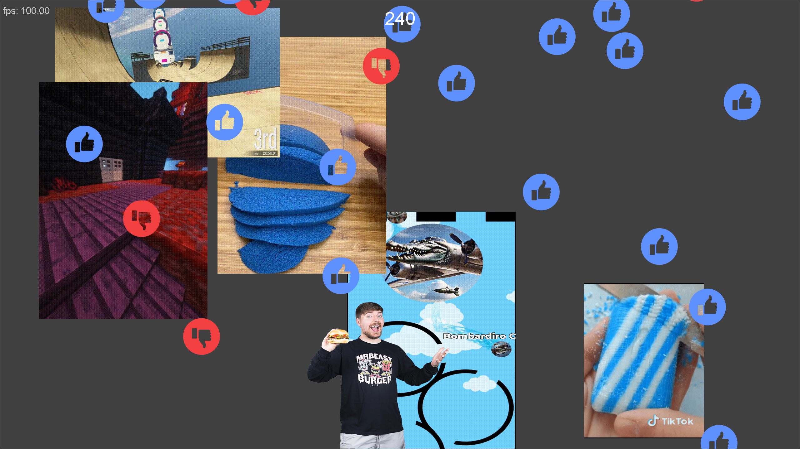

# Mr Beast Simulator
Just a silly little game about collecting as many likes as possible with MrBeast.<br/>
It also has texture packs if you can figure it out.

## Controls
```
movement:   arrowkeys or wasd
jump:       space
shop:       b
```
## Installation
You just need to download `MrBeast.jar` from the releases. Then execute it with java. Textures are included in jar file!

## Building from Source
1. Download the source code using git or just as a zip.<br/>
`git clone https://github.com/I-Bims/MrBeastSimulator.git`
2. You need to download the textures seperatly unfortunally because the files are too big.<br/>
   To do that you need to go to this link: [Textures](https://drive.google.com/file/d/1FSBybNQ0Ml9k5qRybyvk65wR-m6pqJnL/view?usp=sharing)
3. Create a build folder and put the texture pack in there like this:

```
  ├── build.sh
  ├── build
      ├── default
  │   │   ├── d_dislike.png
  │   │   ├── index.conf
  .   .   ├── l_like.png
  .   .   ├── o_hopeless.gif
  .
  ├── Dislike.java
  ├── Game.java
  ├── GameObject.java
  ├── GamePanel.java
  ├── Input.java
  ├── Like.java
  ├── Meme.java
  ├── Player.java
  ├── README.md
  ├── RoundedButton.java
  ├── ShopItem.java
  ├── Ui.java
  └── Util.java
   ```
4. Then install java I haven't testet many versions but 21 works fine
5. Next execute the `build.sh` or the `build.bat` depending if you are on Windows
6. Your done! Hope it works well :)


## Adding Texture Packs
All folders in the same directory as the class files\
with an `index.conf` file are considered a Texture Pack.\
The `index.conf` file can have these options:
```
   enabled=true
   video.enabled=true
   likes.enabled=true
   dislikes.enabled=true
   player.enabled=true
   gameover.enabled=true
```
If the file does not contian an option then this option is considered false.\
The texture files in the texture pack are prefixed like this:
```
player:          p_filename.png or p_filename.jpg 
videos(gif):     v_filename.gif
audio(wav):      s_v_filename.gif.wav (s_[filename of the corresponding video].wav)
likes:           l_filename.png or l_filename.jpg
dislikes:        d_filename.png or d_filename.jpg
endscreen-gif:   o_filename.gif
```
All gifs can also be switched out for pngs

## Screenshots



